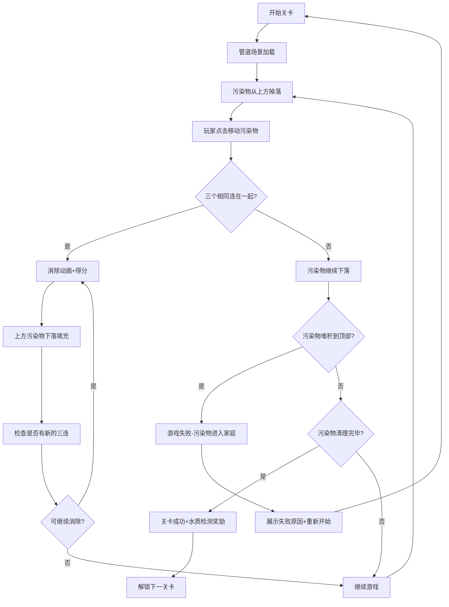
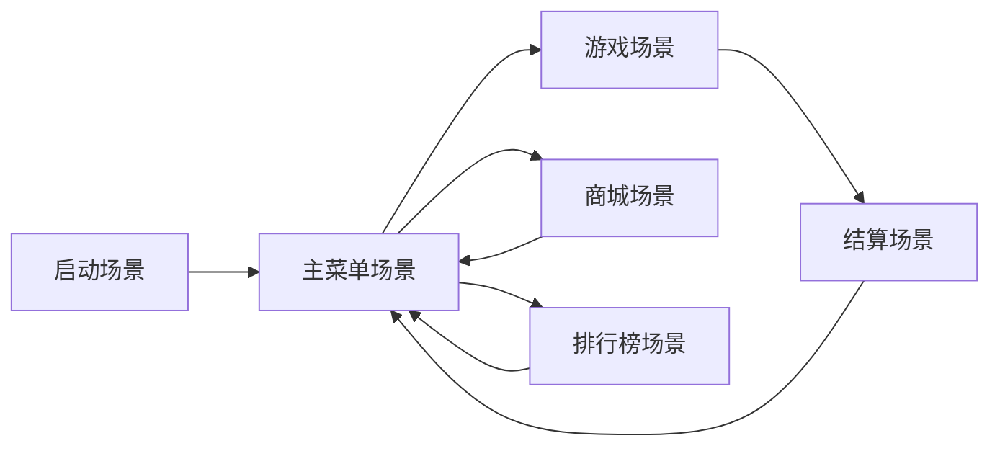
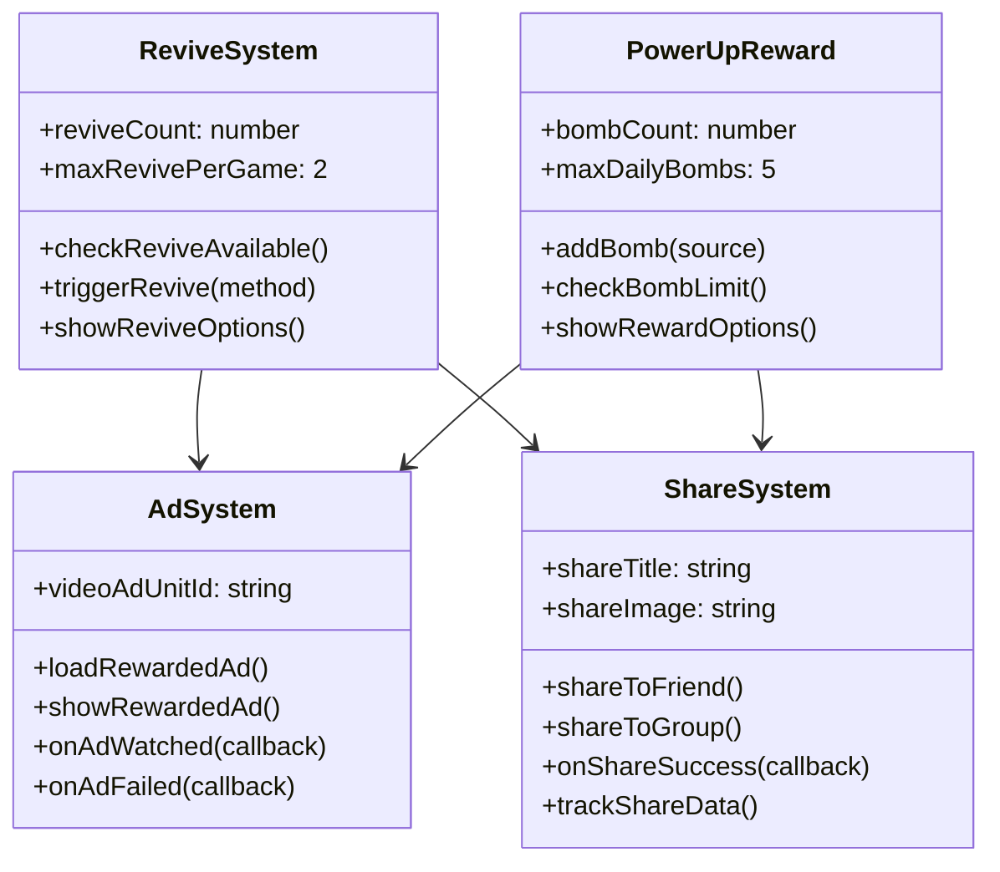
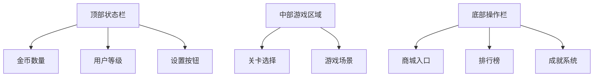
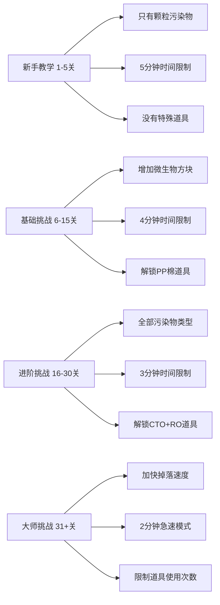
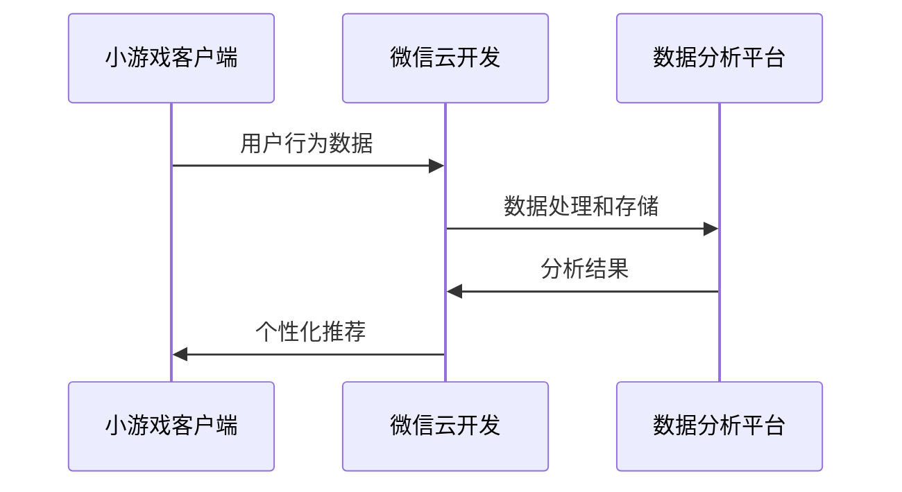

# 点点够净水器品牌小游戏设计文档

## 1. 概述

### 1.1 项目背景
为"点点够"净水器品牌开发一款微信小游戏，针对中国净水器市场的真实需求：虽然自来水厂出水符合饮用标准，但在输送到家庭的管道过程中容易受到二次污染。通过寓教于乐的方式传达品牌核心价值：RO反渗透技术和超值性价比（980元用2年），让用户了解家庭终端净水的重要性。

### 1.2 目标用户
- 主要用户：25-45岁有家庭的消费者
- 次要用户：关注健康生活的年轻人
- 潜在用户：对净水产品感兴趣的微信用户

### 1.3 核心目标
- 品牌曝光和认知度提升
- 产品特色宣传（RO反渗透、性价比）
- 用户互动和社交传播
- 潜在客户线索收集

## 2. 游戏核心概念

### 2.1 游戏主题
**"管道净化消消乐"** - 结合密室逃脱的紧张感和消消乐的易上手特性，玩家需要在有限时间内通过消除相同污染物来清理管道，阻止污染物进入家庭用水系统。

### 2.2 游戏类型
消消乐 + 密室逃脱 + 时间管理

### 2.3 核心玩法


## 3. 技术架构

### 3.1 技术栈
- **前端框架**: 微信小游戏原生API + Canvas 2D
- **游戏引擎**: Cocos Creator 或 Laya引擎
- **后端服务**: Node.js + Express
- **数据库**: MongoDB
- **云服务**: 微信云开发

### 3.2 项目结构
```
WaterGame/
├── assets/                    # 游戏资源
│   ├── images/               # 图片资源
│   ├── sounds/               # 音效资源
│   └── animations/           # 动画资源
├── src/
│   ├── scenes/               # 游戏场景
│   ├── components/           # 游戏组件
│   ├── managers/             # 管理器
│   ├── data/                 # 数据模型
│   └── utils/                # 工具函数
├── cloud/                    # 云函数
└── config/                   # 配置文件
```

## 4. 游戏架构设计

### 4.1 场景管理


### 4.2 核心组件架构

#### 4.2.1 游戏管理器 (GameManager)
- 游戏状态控制
- 关卡进度管理
- 分数计算
- 生命值管理

#### 4.2.2 污染物消除系统 (PollutantMatchSystem)
```mermaid
classDiagram
    class PollutantBlock {
        +type: string
        +color: string
        +position: {x, y}
        +size: string
        +canMatch: boolean
        +move(direction)
        +checkMatch()
        +eliminate()
    }
    
    class ParticleBlock {
        +type: "particle"
        +color: "brown"
        +hardness: "easy"
        +description: "颗粒污染物(铁锈、泥沙)"
    }
    
    class MicrobeBlock {
        +type: "microbe"
        +color: "green"
        +hardness: "medium"
        +description: "微生物(细菌、病毒)"
    }
    
    class ChemicalBlock {
        +type: "chemical"
        +color: "purple"
        +hardness: "hard"
        +description: "化学污染物(重金属、农药)"
    }
    
    class MatchEngine {
        +detectThreeMatch()
        +eliminateBlocks()
        +dropNewBlocks()
        +calculateScore()
    }
    
    PollutantBlock <|-- ParticleBlock
    PollutantBlock <|-- MicrobeBlock
    PollutantBlock <|-- ChemicalBlock
    MatchEngine --> PollutantBlock
```

#### 4.2.4 复活与奖励系统 (ReviveRewardSystem)


### 4.3 数据模型

#### 4.3.1 用户数据模型
```javascript
UserData = {
    openId: string,
    nickname: string,
    avatar: string,
    level: number,
    totalScore: number,
    coins: number,
    achievements: Array,
    unlockedLevels: Array,
    equipment: {
        purifiers: Array,
        upgrades: Object
    }
}
```

#### 4.3.3 复活与道具数据模型
```javascript
ReviveRewardData = {
    revive: {
        usedCount: number,      // 本局已使用复活次数
        maxPerGame: 2,          // 每局最大复活次数
        methods: {
            watchAd: boolean,    // 是否可看广告复活
            share: boolean       // 是否可分享复活
        }
    },
    powerUps: {
        bombs: {
            count: number,       // 当前炸弹数量
            dailyEarned: number, // 今日已获得数量
            maxDaily: 5,         // 每日最大获得数量
            lastResetDate: string // 上次重置日期
        }
    },
    adTracking: {
        totalWatched: number,    // 总观看次数
        todayWatched: number,    // 今日观看次数
        lastAdTime: timestamp    // 上次看广告时间
    },
    shareTracking: {
        totalShares: number,     // 总分享次数
        todayShares: number,     // 今日分享次数
        shareSuccess: number     // 成功分享次数
    }
}
```

## 5. 游戏功能设计

### 5.1 核心功能模块

### 5.1 核心消消乐机制

#### 5.1.1 污染物方块设计
**颗粒污染物(棕色方块)**
- 外观：棕色圆形方块，内部有沙子和铁锈的纹理
- 代表：沙子、铁锈、泥沙等大颗粒杂质
- 难度：最容易消除，三个连成线即可
- 游戏表现：PP棉过滤效果，消除时有过滤网动画

**微生物方块(绿色方块)**
- 外观：绿色液体状方块，内部有细菌动画效果
- 代表：细菌、病毒、藻类等微生物
- 难度：中等难度，需要精确三连消除
- 游戏表现：消除时有杀菌紫外线效果

**化学污染物(紫色方块)**
- 外观：紫色半透明方块，有有毒符号标识
- 代表：重金属、农药残留、化学试剂等
- 难度：最难消除，可能需要四连或特殊道具
- 游戏表现：只有RO技术才能完全消除，消除时有分子过滤动画

#### 5.1.2 消除机制设计
**基础三连消除**
- 横向、纵向、L形、T形都可以消除
- 不同类型污染物消除难度不同
- 连击消除有加分奖励

**特殊道具系统**
- **PP棉炸弹**: 清除四周的3x3区域的颗粒污染物
- **CTO激光**: 清除整行或整列的微生物
- **RO清洁波**: 清除全屏幕所有指定类型的污染物

#### 5.1.3 密室逃脱元素
**时间压力**
- 每关有3-5分钟时间限制
- 倒计时显示，最后30秒音效加速
- 时间不足时污染物下落速度加快

**失败条件**
- 污染物堆积到游戏区域顶部(“家庭入水口”)
- 时间耗尽但污染物未清理完毕
- 失败时展示“污染水源进入家庭”的效果

**成功条件**
- 在时间限制内清理所有污染物
- 达到目标得分(不同关卡要求不同)
- 成功后触发水质检测小游戏

### 5.2 水质检测奖励游戏

#### 5.2.1 通关后的检测环节
**检测方式**
- 每关通关后触发一个简单的水质检测小游戏
- 玩家可以选择跳过或参与，参与有额外奖励
- 检测结果会显示"净化前后对比"

**TDS快速检测**
- 点击将TDS笔放入水杯，2秒后显示结果
- 成功奖励：额外金币 + 知识小贴士

**余氯测试**
- 滴入试剂看气泡反应，有趣味性且简单
- 成功奖励：特殊道具 + 健康知识

#### 5.2.2 知识科普小卡片
- 每次检测后展示一个趣味知识点
- 内容简单易懂，如"你知道吗？TDS越低不一定越好哦！"
- 可以收藏到“知识图鉴”中

### 5.4 复活系统设计

#### 5.4.1 游戏复活机制
**复活触发条件**
- 污染物堆积到顶部（家庭入水口）时触发
- 每局游戏最多可复活2次
- 复活后清除部分污染物，给予10秒额外时间

**复活方式一：看广告复活**
- 点击“看广告复活”按钮
- 播放腾讯流量主的激励视频广告（30-60秒）
- 广告播放完成后获得复活机会
- 失败处理：广告加载失败或用户提前关闭时显示其他选项

**复活方式二：分享复活**
- 点击“分享复活”按钮
- 选择分享到微信好友或微信群
- 分享成功后立即获得复活机会
- 分享文案：“我在《管道净化消消乐》中遇到难关，快来帮我一起净化水源吧！”

#### 5.4.2 道具获取系统
**炸弹道具获取**
- 每日最多可获得5个免费炸弹
- 获取方式与复活系统相同：看广告或分享

**看广告获得炸弹**
- 在游戏主界面或游戏中点击“免费炸弹”
- 播放15-30秒的激励视频广告
- 广告完成后获得一个随机道具（PP棉/CTO/RO中一种）

**分享获得炸弹**
- 在主界面点击“分享获得道具”
- 分享文案：“《点点够管道净化游戏》太好玩了！还能学到水质知识，快来一起体验吧！”
- 分享成功后获得随机道具

#### 5.1.4 品牌元素融入
- **产品展示**: 游戏中净水器外观基于真实产品设计，展示5G芯片模块
- **滤芯科普**: 游戏中直观展示PP棉、CTO、RO三级过滤效果
- **价格优势**: 游戏商城体现"980元用2年"的性价比
- **智能体验**: 通过游戏中的远程控制和实时监测体验产品黑科技
- **水质教育**: 通过趣味检测游戏普及水质知识
- **问题识别**: 让玩家了解管道二次污染的存在和危害
- **解决方案**: 强调家庭终端净水器的必要性和有效性

### 5.2 水质检测小游戏

#### 5.2.1 TDS测试游戏
- **操作方式**: 点击TDS笔，将其放入水杯，观察数值变化
- **判断标准**: 0-50(优秀)、50-100(良好)、100-300(一般)、300+(差)
- **视觉反馈**: 数值颜色随水质等级变化，绿色到红色渐变

#### 5.2.2 余氯检测游戏
- **操作方式**: 滴入检测试剂，观察水中气泡反应
- **结果展示**: 气泡越多表示余氯越多，无气泡为最佳
- **趣味元素**: 气泡爆炸动画效果，增加互动乐趣

#### 5.2.3 PH值检测游戏
- **操作方式**: 将PH试纸放入水中，观察颜色变化
- **颜色对照**: 红色(酸性)、黄色(弱酸)、绿色(中性)、蓝色(弱碱)、紫色(碱性)
- **教育内容**: 简单介绍人体适宜PH值范围(6.5-8.5)

#### 5.2.4 矿物质检测游戏
- **视觉表现**: 水中闪烁的小颗粒代表有益矿物质
- **平衡概念**: 过多和过少都不好，适量最佳
- **互动设计**: 点击收集矿物质颗粒，但不能超过限制

#### 5.2.5 电解小实验
- **简化操作**: 点击电解器开关，观察水中的颜色变化
- **结果展示**: 水质越差颜色越深(黄色到黑色)，清洁水无明显变化
- **科普解释**: 简单说明电解原理，不过于专业

### 5.5 5G智能功能体验

#### 5.5.1 远程控制模拟
**游戏内智能手机**
- 游戏右上角显示一个小手机图标
- 点击后弹出“点点够APP”界面
- 可以查看当前水质状态和滤芯余量

**智能提醒系统**
- 当污染物堆积过多时，手机会震动提醒
- 玩家可以点击“远程强冲”按钮
- 强冲后会清除一小部分污染物，但有冷却时间

#### 5.5.2 品牌特色展示
- **产品外观**: 游戏中的净水器形象基于真实产品
- **5G芯片展示**: 净水器上有闪烁的芯片指示灯
- **价格优势**: 游戏内商城展示“980元用2年”的价值
- **技术科普**: 通过游戏教育用户了解RO技术原理
### 5.6 社交功能

#### 5.6.1 排行榜系统
- 周排行榜
- 好友排行榜
- 全服排行榜

#### 5.6.2 分享机制
- 通关成就分享
- 邀请好友获得奖励
- 品牌信息传播

## 6. 用户界面设计

### 6.1 主界面布局


### 6.2 游戏场景界面
- **游戏区域**（中心）：8x12的消消乐区域，从上往下掉落污染物
- **家庭入口**（顶部）：代表家庭的用水入口，污染物不能达到这里
- **污染源显示**（左侧）：显示污染物来源（老化管道、二次供水等）
- **净水器展示**（右侧）：展示点点够净水器工作状态
- **智能手机**（右上角）：5G远程控制入口
- **时间进度条**（顶部）：倒计时和紧急提醒
- **道具栏**（底部）：PP棉、CTO、RO特殊道具
- **得分显示**（左上角）：当前得分和连击数

### 6.3 复活界面设计
- **游戏结束弹窗**: 显示“污染物进入家庭！”的失败提示
- **复活选项卡片**: 两个并排的按钮
  - 左侧：“看广告复活” + 广告图标
  - 右侧：“分享复活” + 微信图标
- **复活次数显示**: “本局剩余复活次数：X/2”
- **放弃游戏按钮**: 小字体的“放弃”选项

### 6.4 道具获取界面
- **主界面入口**: “免费道具”按钮，显示剩余获取次数
- **获取方式选择**:
  - “看广告获得” + 倒计时显示
  - “分享获得” + 今日剩余次数
- **奖励预览**: 显示可获得的道具类型和数量

### 6.5 品牌展示区域
- 开场Logo展示
- 游戏内产品介绍弹窗
- 通关奖励页面品牌信息
- 分享页面品牌水印

## 7. 游戏平衡性设计

### 7.1 难度设计


### 7.2 经济系统
- **金币获取**: 通关奖励、成就奖励、每日登录
- **金币消耗**: 购买净水器、升级设备、购买道具
- **付费设计**: 可选付费加速，不影响核心体验

### 7.3 留存机制
- 每日任务系统
- 签到奖励
- 限时活动
- 新关卡定期更新

## 8. 营销功能设计

### 8.1 品牌传播机制
- **开场科普动画**: 5秒动画展示“水厂合格水 → 管道污染 → 家庭终端问题”
- **问题识别环节**: 关卡间插入管道污染小知识，如“你知道吗？自来水在管道中可能受到二次污染”
- **产品介绍**: 通关后弹窗展示点点够净水器的RO技术优势
- **价格展示**: 游戏商城显示真实产品信息和“980元用2年”价值主张
- **解决方案引导**: 游戏内一键咨询功能，引导用户了解家庭净水解决方案
- **健康意识提升**: 强调家庭用水安全的重要性

### 8.2 用户教育与线索收集
- **水质知识普及**: 通过游戏介绍管道污染的各种来源和危害
- **产品价值传递**: 展示RO反渗透技术如何有效处理管道二次污染
- **成本意识**: 通过游戏对比展示“980元用2年”的超值性价比
- **需求激发**: 高分玩家邀请参与水质检测活动
- **健康问卷**: 游戏内嵌入家庭用水习惯调研
- **产品体验**: 免费水质检测和产品试用申请

### 8.4 复活与道具营销策略

#### 8.4.1 广告变现机制
- **激励视频广告**: 与腾讯流量主平台对接，获得广告收入分成
- **广告频率控制**: 避免过度打扰用户体验，合理设置广告触发频率
- **个性化广告**: 根据用户游戏习惯和地域特点展示相关广告

#### 8.4.2 社交传播优化
- **分享内容优化**: 设计吸引人的分享文案和图片
- **好友邀请机制**: 分享成功后给予分享者额外奖励
- **群聊传播**: 鼓励分享到微信群，扩大传播范围
- **病毒式传播**: 在游戏中融入“帮助好友”的社交元素

#### 8.4.3 用户留存优化
- **每日免费道具**: 鼓励用户每天登录获取免费资源
- **限时特殊活动**: 在特定时段增加广告奖励或分享奖励
- **成就系统**: 达成特定成就后获得特殊道具奖励
```

## 9. 数据流设计

### 9.1 用户行为数据收集
- **游戏体验数据**: 游戏时长、关卡通过率、放弃点分析
- **知识吸收数据**: 科普内容查看时长、互动点击率
- **品牌认知数据**: 产品介绍页面停留时间、咨询按钮点击率
- **用户意向数据**: 水质检测申请、产品试用兴趣、购买意向调研
- **社交传播数据**: 分享次数、点击转化率、二次传播率
- **用户画像数据**: 年龄、地域、家庭组成、消费能力等

### 9.2 数据上报机制


## 10. 性能优化

### 10.1 资源管理
- 图片资源压缩和懒加载
- 音效资源按需加载
- 缓存策略优化

### 10.2 内存管理
- 对象池管理游戏实体
- 及时释放不用的资源
- 场景切换时的内存清理

### 10.3 网络优化
- 数据传输压缩
- 离线功能支持
- 网络断线重连机制

## 11. 安全设计

### 11.1 数据安全
- 用户数据加密存储
- 游戏存档云端同步
- 防刷分机制

### 11.2 内容安全
- 用户昵称内容过滤
- 分享内容审核
- 违规行为检测

## 12. 测试策略

### 12.1 功能测试
- 游戏核心玩法测试
- 用户界面交互测试
- 数据存储和同步测试
- 分享功能测试

### 12.2 性能测试
- 不同机型适配测试
- 内存使用情况测试
- 网络环境测试
- 长时间游戏稳定性测试

### 12.3 用户体验与教育效果测试
- **知识传达效果测试**: A/B测试不同的科普内容展示方式
- **品牌认知提升测试**: 游戏前后用户对品牌认知度对比
- **购买意向转化测试**: 游戏体验后的咨询和购买意向变化
- **教育内容优化测试**: 不同的管道污染科普内容的用户接受度
- **社交传播效果测试**: 不同分享文案和图片的传播效果对比